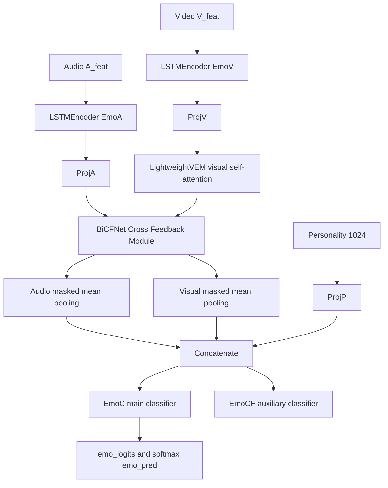

# 02 模型原理与代码对应关系

所有模型读取的是预提取特征，不直接读取原始 wav 或视频帧。符号：A=`[B,T,Da]`，V=`[B,T,Dv]`，P=`[B,1024]`，二分类输出=`[B,2]`。

## SVM

- 是什么：在特征空间中寻找分类边界的传统模型。
- 为什么加入：提供稳定、训练快的非深度基线。
- 输入/结构/输出：mean(A)+mean(V)+P → StandardScaler → RBF SVC → 两类概率。
- 优点：小数据常有竞争力；缺点：丢失时间顺序，样本很大时变慢。
- 代码：`experiments/classical/svm_baseline.py`。
- MPDD 适配：Scaler 封装在 Pipeline，仅拟合训练 fold。

## XGBoost

- 是什么：逐步组合多棵提升树的传统模型。
- 为什么加入：补充非线性树模型基线。
- 输入/输出：与 SVM 相同的 pooled feature，输出两类概率。
- 优点：表格特征表现常较强；缺点：依赖额外包，也丢失时间顺序。
- 代码：`experiments/classical/xgboost_baseline.py`。
- MPDD 适配：延迟 import；缺包只让该模型 SKIPPED。当前未安装，未进行 forward/fit 验证。

## MLP

- 是什么：多层全连接神经网络。
- 为什么加入：最简单的深度学习基线。
- 结构：masked mean(A/V)+P → Linear/ReLU/Dropout ×2 → classifier。
- 优点：简单快速；缺点：时间顺序被池化。
- 代码：`models/mlp_model.py`；公共训练接口在 `models/av_model.py`。
- MPDD 适配：支持 padding mask、可关闭 personality、统一 BaseModel 输出。

## BiLSTM

- 是什么：正向和反向同时编码序列的 LSTM。
- 为什么加入：检查显式时间建模是否优于 MLP。
- 结构：A/V 各自双向 LSTM → masked mean → P projection → classifier。
- 优点：利用前后文；缺点：串行计算、参数更多。
- 代码：`models/bilstm_model.py`，复用 `models/networks/lstm.py`。
- MPDD 适配：明确双向输出为 `2×hidden`，不复制已有 LSTM。

## LightWeightTrans

- 是什么：较浅的自注意力序列编码器。
- 为什么加入：对比注意力与循环模型。
- 结构：A/V 各自复用 TransEncoder → masked mean → P projection → classifier。
- 优点：并行建模长距离关系；缺点：注意力随序列长度增长。
- 代码：组件 `models/networks/LightWeightTrans.py`，完整 adapter `models/lightweighttrans_model.py`。
- MPDD 适配：处理 batch-first/sequence-first 转换并统一分类接口。

## LMF

- 是什么：用低秩因子近似多模态高阶交互。
- 为什么加入：在控制参数量的同时显式融合 A/V/P。
- 结构：pooled A/V/P projection → 增广常数 1 → rank 因子乘积 → classifier。
- 优点：表达乘性交互且比完整张量融合省参数；缺点：rank 需调节，仍先把序列池化。
- 代码：`models/networks/lmf.py`、`models/lmf_model.py`。
- 来源：https://github.com/Justin1904/Low-rank-Multimodal-Fusion
- MPDD 适配：只保留低秩融合思想，使用本项目 Dataset 和训练接口。

## MulT

- 是什么：通过跨模态注意力让一个模态查询另一个模态。
- 为什么加入：保留序列级音视频交互。
- 结构：A→V 与 V→A cross attention → residual/FFN → masked pooling → multimodal projection；P 只做 late fusion。
- 优点：能建模跨模态时间关系；缺点：计算量高于简单池化模型。
- 代码：`models/networks/mult/`、`models/mult_model.py`。
- 来源：https://github.com/yaohungt/Multimodal-Transformer
- MPDD 适配：没有复制 MOSI/MOSEI/IEMOCAP pipeline，也没有把 P 复制 T 次。

## OurModel（BiCFNet）

- 是什么：原仓库的 MPDD-specific baseline。
- 为什么加入：它代表现有项目方法，是比较锚点。
- 优点：视觉增强、双向反馈与 personality 联合建模；缺点：结构较复杂，原辅助 Focal Loss 与其他模型需区分。
- 代码：`models/our/our_model.py`。
- MPDD 适配：只增加 Registry、推理目录和 checkpoint 兼容相关最小修改；核心前向保持。

## DepMamba

- 是什么：任务指定的基于 Mamba 的多模态抑郁检测参考模型。
- 为什么加入：未来比较状态空间序列建模。
- 预期输入/输出：A/V/P 到二分类 logits；当前没有声称已完成内部适配。
- 优点：参考方法面向抑郁检测；缺点：Windows 下 mamba_ssm/causal_conv1d 兼容性敏感。
- 代码：安全入口 `models/depmamba_model.py`，保留包 `models/networks/depmamba/`。
- 来源：https://github.com/Jiaxin-Ye/DepMamba
- 当前状态：SKIPPED，依赖缺失且适配未验证。

## Proposed Model

- 是什么：团队未来最终模型的接口位置。
- 为什么加入：固定未来 Registry 名称和目录。
- 输入/输出：计划沿用统一 A/V/P 与 `[B,2]`；当前无实现。
- 优缺点：尚无科学依据，不能描述或比较。
- 代码：`models/proposed_model.py`。
- 当前状态：N/A；调用会明确抛出未实现错误，不产生结果。
