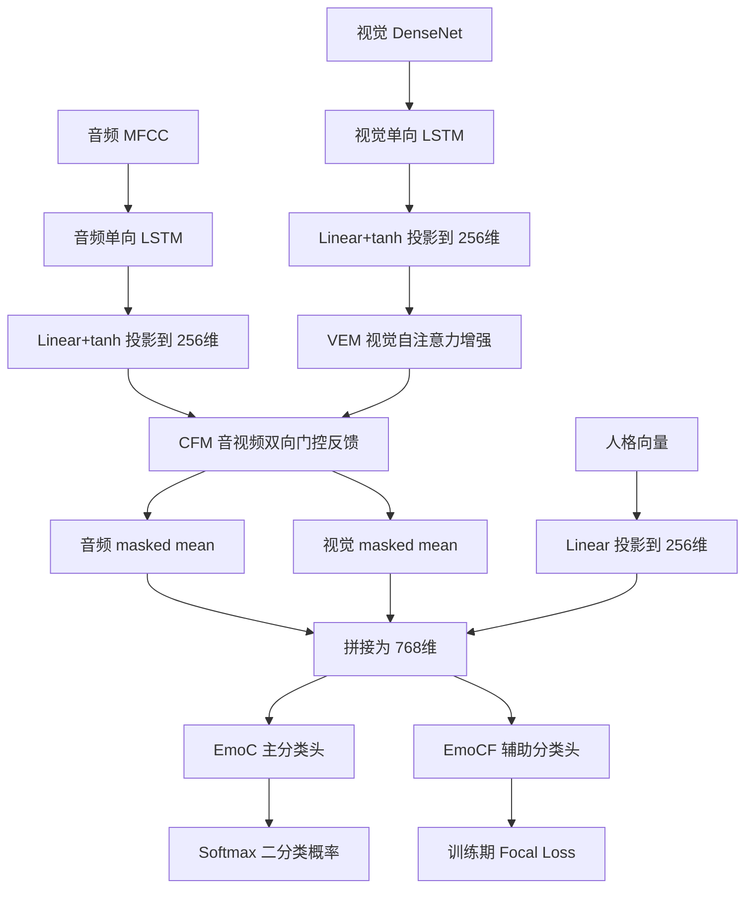

# OurModel forward 与旧版 BiCFNet 实验协议

日期：2026-09-08

## 1. 当前默认方案

实验入口现在默认使用 `legacy_bicfnet` 协议，以接近项目负责人留下的旧版 BiCFNet/OurModel 训练记录：

| 项目 | 旧版默认值 |
|---|---:|
| 随机种子 | 2024 |
| 特征序列最大长度 | 26 |
| Batch Size | 8 |
| 最大训练轮数 | 300 |
| OurModel 学习率 | 2e-5 |
| OurModel weight decay | 0.01 |
| 主交叉熵权重 | 1.0 |
| 辅助 Focal Loss 权重 | 0.1 |
| 学习率调度 | CosineAnnealingLR，eta_min=1e-6 |
| checkpoint 选择 | 验证集 Macro-F1 最高的 epoch |
| 受试者聚合 | 多数投票，平票时用平均概率决胜 |

旧版协议的五折结果单独写入 `experiments/results_legacy_bicfnet`，不会覆盖原先 `experiments/results` 及此前的独立测试 CSV。原来的 20 轮配置没有删除；只有明确传入 `--protocol modern` 时才启用。

旧版受试者划分缓存也使用独立目录 `experiments/splits/legacy_bicfnet/<年份>/<人群>`。这是因为旧版 seed 2024 与现代协议 seed 3407 的划分不兼容；两套缓存必须分开保存，不能用 `--force` 覆盖原缓存。

这次改造没有把旧的 `train.py`、`test.py`、历史日志或 checkpoint 删除，也没有更改 OurModel 网络结构。变化集中在新增协议配置、五折训练选择逻辑及独立测试聚合逻辑。

## 2. 输入与张量形状

OurModel 输入的是预提取特征，不直接处理原始音视频。设 batch 大小为 B、序列长度为 T、统一隐藏维度为 D=256：

| 输入 | 典型形状 | 说明 |
|---|---|---|
| `A_feat` | `[B,T,Da]` | MFCC 音频序列 |
| `V_feat` | `[B,T,Dv]` | DenseNet 视觉序列 |
| `personalized_feat` | `[B,1024]` | 受试者人格向量 |
| `emo_label` | `[B]` | 二分类训练标签 |

`feature_max_len=26` 表示序列补齐或截断长度；它和 `split_window=1s` 不是同一个概念。

## 3. forward 总流程



### 3.1 输入和 mask

`set_input` 把 batch 搬到模型参数所在设备。只要模型在 CUDA 上，音频、视觉、人格和标签都会进入 GPU。有效帧由特征行是否全零判断：

```text
mask_a = abs(A_feat).sum(-1) > 0
mask_v = abs(V_feat).sum(-1) > 0
```

### 3.2 两路 LSTM 与投影

音频、视觉分别进入单层单向 LSTM，再经独立的 `Linear + tanh` 投影到 256 维。模型名称中的“Bi”指双向跨模态反馈，不是双向 LSTM。当前 `LSTMEncoder` 即使配置 `embd_method=last`，实际仍返回完整时间序列，后续模块处理 `[B,T,256]`。

### 3.3 VEM

VEM 只增强视觉分支：多头自注意力之后进行残差、LayerNorm，再经过 256→512→256 的前馈网络和第二次残差、LayerNorm。视觉 padding 作为 `key_padding_mask` 传给注意力。

### 3.4 CFM

CFM 用两个卷积适配器产生跨模态反馈。视觉摘要反馈给音频，音频摘要反馈给视觉；每个方向再通过 `Linear + Sigmoid` 门控，以残差形式加回原特征。这是一次并行双向反馈，不是 Transformer 跨模态注意力，也不是循环迭代。

CFM 当前不直接接收 mask，因此 padding 可能参与卷积反馈。这是后续消融实验应单独验证的实现因素。

### 3.5 池化、人格与分类头

增强后的音频和视觉各自进行 masked mean，得到两个 `[B,256]` 向量。人格向量经 `Linear(1024→256)`，三路拼接为 `[B,768]`。

主分类头 `EmoC` 和辅助分类头 `EmoCF` 都是 768→128→64→2，但参数独立。最终预测只读取主分类头：

```text
emo_pred = softmax(EmoC(fused_feature))
```

辅助分类头只通过 Focal Loss 参与训练，并不与主分类头做概率平均或投票。

## 4. 训练反向传播

旧版协议下总损失为：

```text
Loss = 1.0 × CrossEntropy(EmoC, label)
     + 0.1 × FocalLoss(EmoCF, label)
```

Focal Loss 使用 `gamma=3` 和 `alpha=[1,8]`。每个 epoch 结束后在该折验证集计算 Macro-F1；只保留严格高于历史最佳值的第一个 epoch，训练结束恢复这份权重并写入 `checkpoint.pth`。checkpoint 配置中同时记录 `protocol`、`best_epoch`、`best_val_macro_f1` 和选择规则。

## 5. 三种独立测试口径

旧版独立测试 CSV 会为每个模型写三行，必须按 `EvaluationLevel` 区分：

| EvaluationLevel | 含义 | 推荐用途 |
|---|---|---|
| `event` | 五折概率平均后的原始事件级结果 | 分析事件级错误 |
| `subject` | 每个受试者多数投票后只计一次 | 论文主结果，避免事件多的人权重更大 |
| `legacy_voted_event` | 受试者投票结果回填到其所有事件再计分 | 与旧 `test.py` 的 227 条混淆矩阵口径对照 |

历史混淆矩阵 `[[187,0],[14,26]]` 属于第三种“投票后回填事件”口径，不能和严格受试者级矩阵直接比较。

## 6. 完整运行命令

下列命令均为 PowerShell 一行形式。前提是终端已处于 `dachuangxiangmu` 环境，因此不再包含 `conda activate` 或 `conda run`。

### 2025 五折训练

```powershell
python experiments\run_all.py --models "svm,xgboost,mlp,bilstm,lightweighttrans,lmf,mult,our" --protocol legacy_bicfnet --dataset-year 2025 --cohort Elder --track Track1 --task binary --data-root "D:\Files\Works\CreationProject\test\2025" --audio-feature mfccs --video-feature densenet --use-personality --personality-id-source filename --split-window 1s --folds 5 --device cuda
```

### 2025 独立测试

```powershell
python experiments\run_independent_test.py --models "svm,xgboost,mlp,bilstm,lightweighttrans,lmf,mult,our" --protocol legacy_bicfnet --dataset-year 2025 --cohort Elder --track Track1 --task binary --data-root "D:\Files\Works\CreationProject\test\2025" --audio-feature mfccs --video-feature densenet --use-personality --personality-id-source filename --split-window 1s --folds 5 --device cuda
```

### 2026 五折训练

```powershell
python experiments\run_all.py --models "svm,xgboost,mlp,bilstm,lightweighttrans,lmf,mult,our" --protocol legacy_bicfnet --dataset-year 2026 --cohort Elder --track Track1 --task binary --data-root "D:\Files\Works\CreationProject\test\2026" --audio-feature mfccs --video-feature densenet --use-personality --personality-id-source subject_id --split-window 1s --folds 5 --device cuda
```

### 2026 独立测试

```powershell
python experiments\run_independent_test.py --models "svm,xgboost,mlp,bilstm,lightweighttrans,lmf,mult,our" --protocol legacy_bicfnet --dataset-year 2026 --cohort Elder --track Track1 --task binary --data-root "D:\Files\Works\CreationProject\test\2026" --audio-feature mfccs --video-feature densenet --use-personality --personality-id-source subject_id --split-window 1s --folds 5 --device cuda
```

## 7. 结果位置

- 五折逐折指标：`experiments/results_legacy_bicfnet/raw_results.csv`
- 旧版五折划分缓存：`experiments/splits/legacy_bicfnet/<年份>/<人群>/`
- 每折 checkpoint：`experiments/results_legacy_bicfnet/raw/<Run_ID>/<模型>/fold_<折号>/checkpoint.pth`
- 独立测试汇总：`experiments/results_legacy_bicfnet/independent_test_results.csv`
- 独立测试逐样本预测：`experiments/results_legacy_bicfnet/independent_test_predictions/`
- 独立测试混淆矩阵数据：`experiments/results_legacy_bicfnet/independent_test_confusion_matrix/`

旧协议提高了复现历史结果的可比性，但不保证 OurModel 一定排名第一。模型排名只能由冻结方案后的实际五折与独立测试结果决定，不能按测试集成绩挑 seed 或只保留获胜运行。
